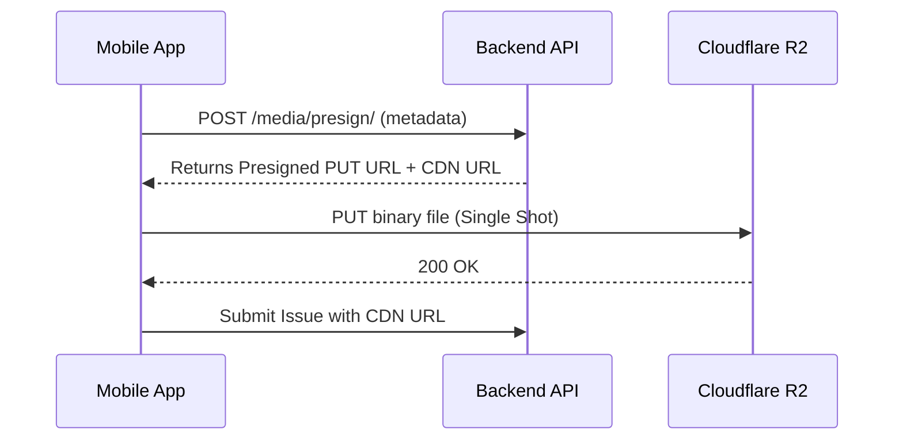
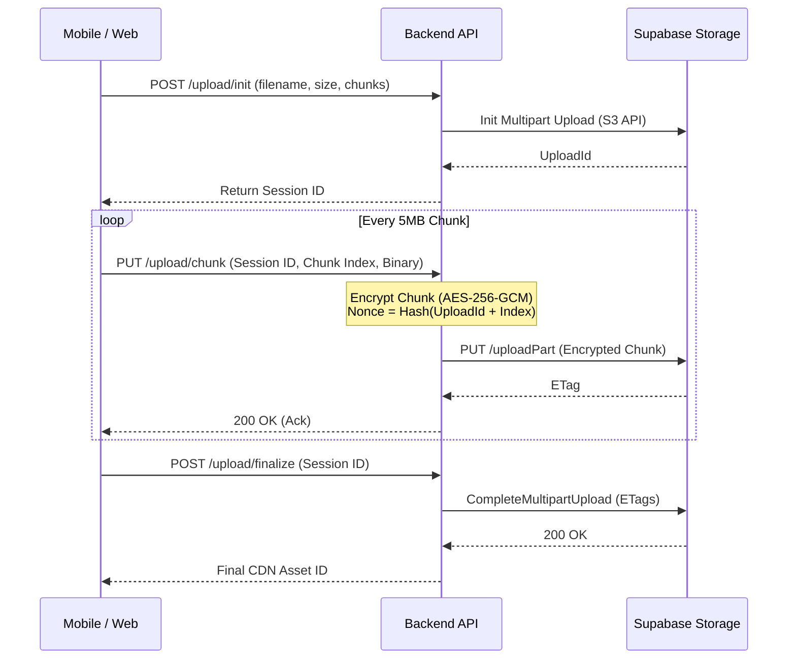

# PrajaPulse CDN & Storage Architectural Review

This document provides a complete end-to-end audit of the PrajaPulse CDN and storage implementation, identifying current bottlenecks and outlining the production-ready architecture for migrating to Supabase Storage with environment-specific encryption.

---

## 1. Current Architecture

Currently, the system relies on a mix of direct backend uploads and direct client-to-storage uploads using Cloudflare R2 (S3-compatible API).

- **Frontend (`CDNClient.ts`)**: Bypasses the application's Axios interceptors to fetch JSON/media directly from the public CDN domain (`media.eduexpertai.com`) using the browser cache. If the CDN fails, it falls back to a server API.
- **Backend (`R2Client.py`)**: Uses `boto3.client('s3')` to perform synchronous, single-shot `put_object` operations for JSON payloads and media. It manually gzip-compresses JSON before upload.
- **Mobile (`presignedUpload.ts`)**: Requests a presigned PUT URL from Django (`/media/presign/`), then uses Expo's `FileSystem.createUploadTask` to perform a single-shot binary PUT directly to R2.

## 2. Current Upload Sequence



## 3. Current Chunking Architecture

**There is currently NO chunking architecture implemented.** 

Both the Backend (`R2Client.py`) and the Mobile app (`presignedUpload.ts`) upload files entirely in memory as a single binary blob. 
- Mobile uses `FileSystem.createUploadTask` which does not support chunking.
- Backend uses `boto3.client().put_object()` which buffers the entire byte array.

---

## 4. Problems Found

- **Security**: The current `CDNClient` relies on public CDN URLs. If media is meant to be private, exposing predictable paths on a public bucket is a data leak.
- **Performance**: Mobile uploads fail on slow networks because large videos (e.g., 50MB+) are sent in a single HTTP request. If the connection drops at 99%, the entire 50MB must be re-uploaded.
- **Reliability**: Mobile has no retry logic for partial uploads, no resumability, and no exponential backoff for network drops. 
- **Scalability**: Backend `R2Client.py` loads entire files into RAM before pushing to R2. A burst of users uploading 100MB videos would immediately crash the Django workers (OOM).

---

## 5. Encryption Analysis

**Requirement:** PROD CDN data must be encrypted so the storage layer (Supabase) cannot read it. DEV does not require encryption. Keys cannot be exposed to the client.

### Where encryption should occur
Because encryption keys *must never reach an untrusted client* (doing so allows attackers to extract the symmetric key from the obfuscated mobile binary or web bundle), **Client-Side Encryption is strictly prohibited.** Encryption and decryption MUST happen on the Django Backend. 

### File-level vs Chunk-level Encryption
We evaluated two approaches for backend encryption:
- **Option A (Encrypt complete file, then chunk)**: Requires the backend to buffer the entire file in RAM to compute the GCM auth tag before uploading. Fails for large videos.
- **Option B (Chunk first, encrypt each chunk)**: The backend receives chunks from the client, encrypts each chunk individually in memory (using `AES-256-GCM`), and pushes the encrypted chunks to Supabase. 

**Conclusion:** **Option B is the only scalable choice.** The client uploads 5MB chunks to Django. Django encrypts the 5MB chunk in RAM, uploads it to Supabase via Multipart Upload, and clears its memory. 

---

## 6. Supabase Bucket/Environment Recommendation

**Recommendation:** Use entirely separate Supabase Projects for DEV and PROD. 
Do *not* use a single project with `dev-bucket` and `prod-bucket`.

**Reasoning:**
- **Environment Isolation:** A single project shares the same database, Auth tenant, and API keys. A developer testing a destructive migration or tweaking an RLS policy on the shared project could accidentally wipe production data.
- **Key Management:** Separate projects guarantee that the DEV service keys and PROD service keys are entirely distinct. 

---

## 7. Recommended Architecture

Because encryption keys cannot be exposed to the client, the architecture must diverge based on the environment variable `CDN_ENCRYPTION_ENABLED`.

### Development (`CDN_ENCRYPTION_ENABLED=false`)
The backend generates Supabase Presigned URLs. The client uploads chunks directly to Supabase, bypassing Django to save bandwidth.

### Production (`CDN_ENCRYPTION_ENABLED=true`)
The client uploads chunks directly to Django. Django encrypts them on the fly and pipes them to Supabase.

---

## 8. Recommended Upload Flow (Production)



---

## 9. Recommended Download Flow (Production)

To view an encrypted video, the client cannot use a public CDN URL. 

1. **Client** requests the file: `GET /media/stream/<asset_id>` (with Bearer Token).
2. **Django** verifies JWT auth and permissions.
3. **Django** opens a streaming request to Supabase Storage using its internal Service Role key.
4. **Django** reads the encrypted chunks as they stream in, decrypts them on the fly, and yields the plaintext binary stream via `StreamingHttpResponse` to the client.

---

## 10. Code-Level Changes

1. **Mobile (`presignedUpload.ts`)**: Replace `FileSystem.createUploadTask` with a custom Chunking Manager. It should slice files into 5MB parts using `expo-file-system` and upload them sequentially with exponential backoff.
2. **Frontend (`CDNClient.ts`)**: Remove the public `fetch()` logic for sensitive data. Point it to the secure Django proxy endpoint (`/media/stream/`).
3. **Backend (`R2Client.py`)**: Rename to `StorageManager.py`. Implement S3 Multipart Upload APIs (`create_multipart_upload`, `upload_part`, `complete_multipart_upload`).
4. **Backend Encryption**: Create `crypto.py` wrapping the `cryptography` package to handle AES-256-GCM chunk encryption.

---

## 11. Migration Strategy

- **Development Data:** Existing plaintext files in DEV can remain as-is.
- **Production Data:** If there are existing plaintext files in production, a one-off Django management command must be written to download each file, encrypt it, and re-upload it. 
- A database flag (`is_encrypted=True`) should be added to the `Media` or `Issue` model so the backend knows whether to decrypt the stream on download, allowing for a phased migration.

---

## 12. Security Checklist

- [ ] **Keys:** `CDN_ENCRYPTION_KEY` strictly in backend `.env`.
- [ ] **Signed URLs:** Only used in DEV. PROD streams through Django.
- [ ] **RLS:** Supabase buckets must be set to `Private`. Access is only via Django's Service Role.
- [ ] **Object paths:** Generate paths via UUIDs (e.g., `media/{uuid}.ext`) to prevent path traversal attacks.
- [ ] **MIME validation:** Enforce strict file signatures (magic bytes) on the backend before encrypting.
- [ ] **File size:** Enforce MAX_FILE_SIZE (e.g., 500MB) during the `/upload/init` phase.
- [ ] **Integrity:** Store the GCM Auth Tag at the end of each chunk to ensure ciphertext hasn't been tampered with at rest.

---

## 13. Final Recommended Folder Structure

Centralize CDN logic to avoid web/mobile duplication:

```text
Backend/prajapulse/Praja_Storage/
 ├── manager.py         # S3 Multipart Logic (Supabase)
 ├── crypto.py          # AES-256-GCM chunk encryption
 └── views.py           # UploadInit, UploadChunk, Finalize, StreamDownload

PrajaPulseMobile/components/services/storage/
 ├── uploader.ts        # Chunk slicer & Exponential Backoff retries
 └── streamClient.ts    # Secure authenticated fetch for downloads

FrontEnd/src/services/storage/
 ├── uploader.ts        # Web Blob slicing (File API)
 └── streamClient.ts    # Secure authenticated fetch
```
