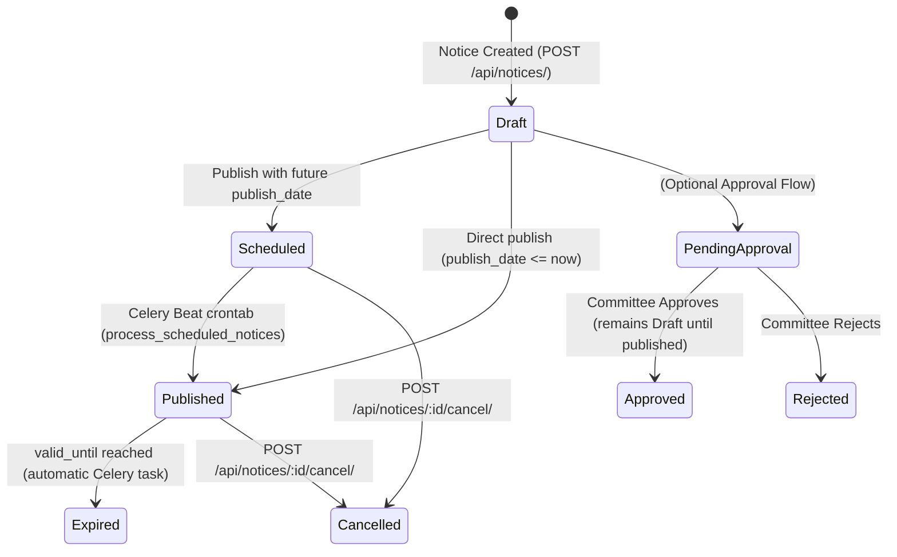

# Notices Module: Architecture & Lifecycle Documentation

This document serves as the comprehensive architectural specification for the **Notices Module** across backend and frontend, detailing the status state machine, targeting engine, lifecycle constraints, and notification pipelines.

---

## 1. Notice Status State Machine

Every `Notice` progresses through an explicit lifecycle governed by business rules in the service layer (`Backend/apt_proj/Apt_Notices/services/notice_service.py`):



### Status Reference Table

| Status | Description | Visible to Residents? | Can Author Edit? | Triggers Push/WS? |
|---|---|---|---|---|
| `Draft` | Saved as draft. Unapproved or unpublished. | ❌ No | ✅ Yes (within 15-min window) | ❌ No |
| `Scheduled` | Queued for future publication. | ❌ No | ❌ No (Locked) | ❌ No (Until release) |
| `Published` | Live and broadcasted to targeted residents. | ✅ Yes (`/api/notices/my-notices/`) | ❌ No (Locked) | ✅ Yes (FCM + WebSockets) |
| `Expired` | Past its `valid_until` expiration date. | ❌ No (Archived) | ❌ No | ❌ No |
| `Cancelled` | Revoked or withdrawn by management. | ❌ No | ❌ No | ❌ No |

---

## 2. Core Business Rules

### Rule 1: The 15-Minute Edit Lock Window
- When a notice is first created, it can be updated (`PUT /api/notices/<id>/`).
- Once `now() > created_at + 15 minutes`, the service layer strictly raises:
  > `"Notice is completely locked 15 minutes after creation."`
- **Rationale:** Prevents altering notice terms or announcements retroactively after residents have read, planned around, or legally acknowledged them.

### Rule 2: Multi-Dimensional Dynamic Targeting (`target_audience`)
The `target_audience` is a JSON array of targeting criteria stored in the database:
```json
[
  { "role": "Owner", "block": "A", "flat": "101" },
  { "role": "Tenant", "block": "B" },
  { "role": "Security" }
]
```
- **Inside each object:** Evaluated as **`AND`** (e.g., must be an `Owner` **AND** in `Block A` **AND** in `Flat 101`).
- **Between objects in the list:** Evaluated as **`OR`** (matches Group 1 **OR** Group 2 **OR** Group 3).
- Evaluated **dynamically** in `targeting_service.py` against the user's current live profile at read time (`/api/notices/my-notices/`). If a tenant changes flats, their visible notice feed instantly reflects their new flat without database updates.

### Rule 3: Acknowledgement Requirements
- If `requires_acknowledgement = True`, the system creates `NoticeAcknowledgement` records for targeted users.
- Residents acknowledge via `POST /api/notices/<id>/acknowledge/`.
- Celery daily beat task monitors pending acknowledgements and sends automated reminders up to `reminder_count < 3` before `acknowledge_by`.

---

## 3. Database Schema

- **`apt_data.apt_proj_notice`**
  - `id`: Auto-increment integer primary key
  - `title`: `CharField(255)`
  - `content`: `TextField`
  - `category`: `CharField(50)` (Choices: `Water`, `Electricity`, `Maintenance`, `Security`, `Facility`, `Finance`, `Community`, `Emergency`, `General`, `Event`, `Holiday`)
  - `priority`: `CharField(50)` (Choices: `Low`, `Medium`, `Critical`)
  - `status`: `CharField(50)` (Choices: `Draft`, `Scheduled`, `Published`, `Expired`, `Cancelled`, Default: `Draft`)
  - `target_audience`: `JSONField` (Default: `[]`)
  - `publish_date`: `DateTimeField(null=True, blank=True)`
  - `valid_until`: `DateTimeField(null=True, blank=True)`
  - `requires_acknowledgement`: `BooleanField(default=False)`
  - `acknowledge_by`: `DateTimeField(null=True, blank=True)`
  - `created_at`: `DateTimeField(auto_now_add=True)`
  - `updated_at`: `DateTimeField(auto_now=True)`
  - `created_by`: `ForeignKey(User, null=True, on_delete=SET_NULL)`

- **`apt_data.apt_proj_noticeattachment`**
  - `notice`: `ForeignKey(Notice, on_delete=CASCADE)`
  - `file`: `FileField(upload_to='notices/')`
  - `file_type`: `CharField(50)`
  - `uploaded_at`: `DateTimeField(auto_now_add=True)`

- **`apt_data.apt_proj_noticeapproval`**
  - Tracks approval/rejection decision, timestamp, decision maker, and rejection reason.

- **`apt_data.apt_proj_noticeacknowledgement`**
  - Tracks user acknowledgement status, timestamp, IP address, and reminder count.

---

## 4. Real-Time Delivery & Background Pipeline

When a notice reaches `Published` state (either immediately or via the Celery cron runner):

```
+-------------------------------------------------------------+
| notice_service.publish_notice(notice, user)                |
+-------------------------------------------------------------+
                              |
                     transaction.on_commit
                              v
+-------------------------------------------------------------+
| Celery Task: send_notification_task.delay(...)              |
+-------------------------------------------------------------+
         |                                          |
         v                                          v
+-----------------------+              +-----------------------+
| FCM Push Notification |              | WebSocket Broadcast   |
| (Mobile / Web Push)   |              | (Daphne / Channels)   |
| Dispatches to Device  |              | Dispatches to channel |
| Tokens                |              | group: 'user_{id}'    |
+-----------------------+              +-----------------------+
                                                    |
                                                    v
                                       +-----------------------+
                                       | Frontend Audio Chime  |
                                       | + Real-time Toast     |
                                       | + Feed Auto-Refresh   |
                                       +-----------------------+
```

---

## 5. Direct Publishing Design (Draft vs Publish)

### The Issue
Previously, `notice_service.create_notice` hardcoded `data['status'] = Notice.Status.DRAFT`, while `NoticeSerializer` marked `status` as a read-only field. When an admin clicked "Publish Notice" in the UI, the frontend called `POST /api/notices/`, leaving the notice stuck in `Draft` state perpetually unless a manual secondary call to `/api/notices/<id>/publish/` was made.

### The Unified Solution
Notice creation directly honors publication intent:
1. If the author intends to publish immediately (or scheduled in the future):
   - Future `publish_date` $\rightarrow$ set `status = Notice.Status.SCHEDULED`.
   - Empty or current `publish_date` $\rightarrow$ set `status = Notice.Status.PUBLISHED`, stamp `publish_date = now()`, and fire the notification pipeline.
2. If explicit draft mode is chosen (e.g. "Save as Draft" button) $\rightarrow$ set `status = Notice.Status.DRAFT`.
